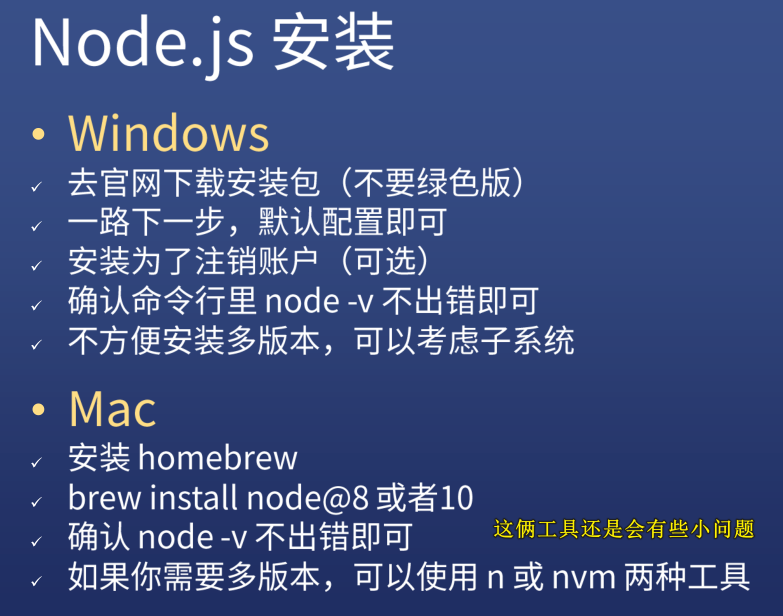
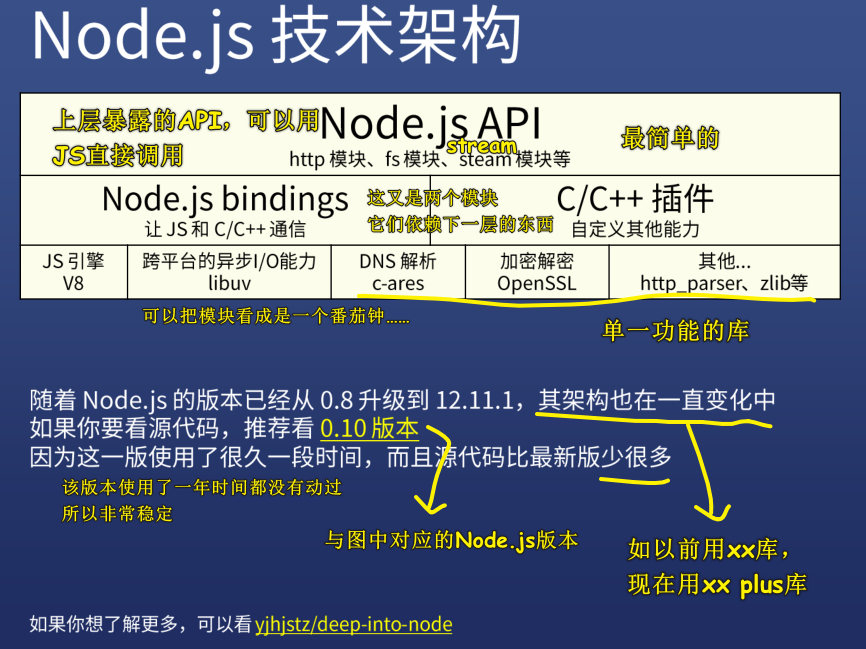
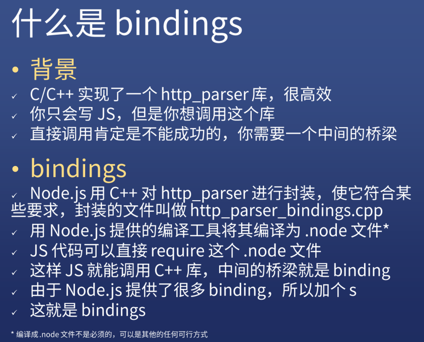
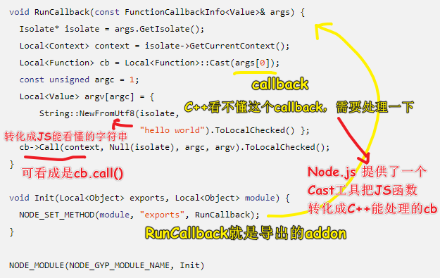

| ✍️ Tangxt | ⏳ 2020-08-11 | 🏷️ 总纲 |

# 01-Node.js 技术架构

> Node.js 是什么，以及它是由什么组成的！ -> 对于前端而言，关于底层 C++代码，只需要知道是做什么的，以及用到了哪些技术就行了！不需要去想这代码的逻辑是怎样的……

## ★引子

我先看了这个 [Node.js 基础篇](https://ppambler.github.io/nodejs/02/) （就看了视频的第一讲），但看完之后，我觉得这些知识点都是很零碎的，虽然内容都讲清楚了，但总觉得自己的脑海里并咩有对 Node.js 建立起一个总体性的认知，于是我就看了方方这节的免费课：[Node.js 全解及 Next.js 框架实践 - 写代码啦！](https://xiedaimala.com/courses/f0e0726e-6073-4b23-b590-387ff879f64a/random/1a2196ecc6#/common)

## ★JS 如何调用 C++

1）Node.js 版本

双数是稳定版，单数是非稳定版，我们使用 8 以上版本

> Vue 3.0 在 8 里用会有些小问题，而 10 就没问题了！

2）Node.js 安装



3）周边工具


4）Node.js 是什么？

> 讲 Node.js 是什么之前，先来讲讲 Node.js 不是什么……

1、Node.js 不是什么？

- **不是 Web 框架**
  - Node.js 并不是 web 后端框架
  - 所以你不能把 Node.js 与 Flask 或 Spring 对比
- **不是编程语言**
  - Node.js 并不是后端的 JS
  - 所以你不能把 Node.js 与 Python 或 PHP 对比

> 不要有这样的说辞「我该学 Node.js 好呢？还是 Python 好呢？」

2、Node.js 是什么？

- **是一个平台**
  - 它将多种技术组合起来了
  - 让 JavaScript 也能调用系统接口、开发后端应用
- Node.js 用到了哪些技术？
  - V8 引擎 -> 作者很牛逼，V1~V8 这 8 个虚拟机，而且这是不同语言的
  - libuv -> 非常有用的库，本来是 Node.js 作者写给自己用的，后来因为此库太有用了，所以导致了其它语言社区也在用这个库
  - C/C++ 实现的各种高性能的库： [c-ares](https://c-ares.haxx.se/)「实现 DNS 解析，域名的解析」、[http-parser](https://github.com/nodejs/http-parser)「解析 http」、[OpenSSL](https://www.openssl.org/)「搞 https」、[zlib](http://zlib.net/)「搞加密」等库

> 我们一般不区分 C 和 C++，因为它们俩都是可以通用的，说用 C 实现的高性能库也好，还是用 C++实现的高性能库也罢！

5）Node.js 技术架构



- [0.10 版本](https://github.com/nodejs/node/tree/v0.10.0-release)
- [node 代码分析](https://github.com/yjhjstz/deep-into-node)：作者用了多篇文章分析了 Node.js 的核心架构 -> 讲得非常详细

接下来，就介绍一下该架构图里边提到的一个个东西！

6）什么是 bindings？



Node.js 它调用了很多 C/C++的库，比如说 C++ 有一个库，叫 http_parser，它可以非常高效地处理 http 的一些内容，如它告诉你这部分是啥，下一部分是啥，每部分都有啥含义等等……

而我们在 Node.js 里，只能写 JS 呀！所以我们该如何调用 C/C++的库呢？

直接调？ -> 显然不行呀！JS 的数据类型与 C++的数据类型根本就不一样 -> 所以这根本就不存在一种直接调用的途径

那咋办呢？

Node.js 作者做了一些中间层的处理，封装了一些东西，如用 C++（必须用这门语言）对 http_parser 进行封装，使其能让 JS 的数据类型与 C++的数据类型统一化，如不管是`int/short/float……`还是啥的，都是`number`类型，都是一一对应的。

封装的结果就是「`http_parser_bindings.cpp`」（还有其它头文件）

总之，Node.js 作者为了让我们能够使用 `http_parser`，所以就写了一个 `http_parser_bindings.cpp`

除此之外，Node.js 还提供了一个编译工具，可以把 `http_parser_bindings.cpp` 编译成 `.node`这样的二进制文件或者可执行文件

我们的 JS 不能直接 require `.cpp`文件，但可以 require `.node`文件，这样一来，JS 就能调用 C++库了，而 Node.js 作者写的这个`http_parser_bindings.cpp`就叫做「binding」啦！

Node.js 作者除了封装 `http_parser` 这个库以外，还封装了其它库，也就是 Node.js 还提供了很多个`binding`，所以这就是「`bindings`」了！

由于是 Node.js 提供的 binding，所以全名就是「**Node.js bindings**」

回过头来看，Node.js 是如何使 JS 和 C/C++ 通信的呢？

> Node.js 在这中间加了一个个 C++ 模块，它可以使得这两者之间在数据类型上统一，以及其它方面的一些协调！

7）JS 与 C++交互

> Node.js 还提供了其它交互方式，我这里只举其中的一个例子

- JS 调用 C++代码： [官方示例 1](http://nodejs.cn/api/addons.html#addons_function_arguments)
- C++调用 JS 回调：[官方示例 2](http://nodejs.cn/api/addons.html#addons_callbacks)

如何用 JS 调用 C++（自顶向下）？如何用 C++调用 JS 的函数（自底向上）？

1、示例 1

上述示例 1 里边的内容是 Node.js 的插件内容——**告诉我们如何写一个 C++的库，以及如何用 JS 调用这个库！**

如你写了一个 `addon.cc`（不完全是 C 代码，夹杂着 C++代码，所以就说成是`C/C++`了） -> 编译它 -> 得到`.node`文件 -> 在 JS 里使用它`const addon = require('./build/Release/addon')`（可以省略`.node`后缀）

我们

``` js
addon.add(3, 5)
```

，其实就是做：

``` c++
// add 方法的实现
// args 是你传给 C++的参数数组，也就是类似 [3,5] 这种形式
void Add(const FunctionCallbackInfo<Value>& args) {
  // 如果你只传一个参数就报「参数的数量错误」返回给你 JS
  // 如果你传的不是 Number 类型的，那就报「参数错误」返回给你 JS
  // 两个检查都通过了，那就把俩参数加起来，得到了一个新的 Number 类型的值，然后返回给你 JS，这样 addon.add(3, 5) 就是一个 「8」的返回值
}
```

> 突然感觉，把 JS 数值类型的 `3` 和 `5` ，经过 `binding` **加工**后，变成了 C/C++ 可处理的类型，C/C++ 处理之后，返回了一个  `double` 类型的 `8`，然后再把 `8` 这个值通过 `binding` **过滤**成 JS 可以处理的 `Number`类型 `8`

我看了一下这个：

```c++
void Add(const FunctionCallbackInfo<Value>& args) {
   // 执行操作
  double value =
      args[0].As<Number>()->Value() + args[1].As<Number>()->Value();
  Local<Number> num = Number::New(isolate, value);

  // 设置返回值 （使用传入的 FunctionCallbackInfo<Value>&)。
  args.GetReturnValue().Set(num);
}
```

似乎 `Local<Number> num = Number::New(isolate, value);` 这一步就完成了`double` `8` 的数据类型转换……（`isolate`很复杂）

不管怎样，总体上看，`addon.add(3, 5)`就是在调用`addon.cc`里的`Add`函数（以后如果你想了解`add`这个函数是怎么写的，那么你就得看底层的`.cc`文件了！ -> 关于对象之间的通信：`addon`要做加法行为，被操作的对象是`3`和`5` -> `you.cut('hand')`双十一你要剁手，行为是「剁」，要「剁」的对象是「手」，而不是「脚」）

---

可以看到这个例子是可以证明 JS 是可以直接调用 C++的代码的！（不止是这一种方法可以做到！方方演示的是文档里写的方法）

---

2、示例 2

C++ 如何调用 JS 里的函数？

> 把 JavaScript 函数传入到一个 C++ 函数并在那里执行它们，这在插件里是常见的做法。

``` js
// test.js
const addon = require('./build/Release/addon');

addon((msg) => {
  console.log(msg);
// 打印：'hello world'
});
```

我们把一个 callback 作为一个参数传给了`addon`，我们 JS 并咩有调用`callback`！

 

C++内存里的`String`与 JS 的是不一样的，所以需要构造转化一下……搞成是 JS 能看懂的`String`

C++底层的`addon`执行，其函数体内`cb -> Call("hello world")` -> 也就是把`"hello world"`传给了上层的`(msg) => {console.log(msg)}`去调用 -> 说白了，就是底层抛一个数据给上层的`msg`

> 一个疑问：是底层就执行了`callback`，`log`一个`"hello world"`，还是 把数据抛给上层的 JS，然后交给 `v8` 引擎自己去执行 `callback`？

我觉得是在底层调的`callback`！毕竟`addon`这个函数是 C/C++ 写的！ -> 似乎 V8 引擎就是 C/C++ 写的，所以执行 C/C++ 代码时，应该也是由 V8 引擎做的吧……

---

话说，我写 Node.js ，还要会 C++ 吗？

不用会，你只要知道 JS 和 C/C++ 是如何交互的就行了 -> 大部分人写 Node.js 是不需要会 C++的，而且对于方方来说，方方也不会写 C++代码，只是能看懂，能看懂 C++ 代码在做什么……

---

Node.js 还提供了其它交互方式 -> **只要你能让 JS 去调用 C++ 这件事做好了，那么 JS 的能力就会被无限扩大**

---

接下来，看看 Node.js 的工作流程……

## ★libuv & v8 的功能


