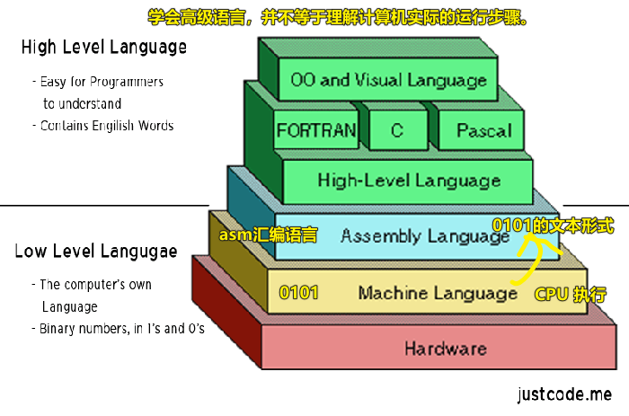
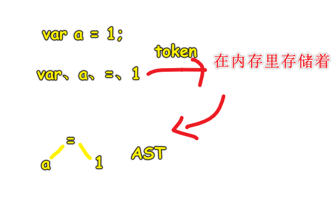
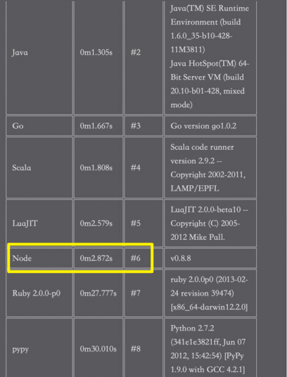

| ✍️ Tangxt | ⏳ 2020-08-09 | 🏷️ 101 |

# 01-编译过程、I_O 操作、node 应用场景

## ★前置知识

> 一定要网络知识 -> 主要是 HTTP 协议……

### <mark>1）Node.js 是什么？</mark>

JavaScript 的运行时 -> 简单来说，就是 JavaScript 的运行环境……就如同浏览器这样

### <mark>2）前后端的区别？</mark>

网络前和网络后

### <mark>3）前端界面基于啥开发？</mark>

- 浏览器：HTML、JS 、CSS
- 安卓：Java、Python、C++、C#
- IOS：C++、Objective-C、Swift

### <mark>4）服务端</mark>

- 系统：Linux（一般用这个）
- 用到的开发语言：Java、C++、Ruby、Python、Go、C#、PHP、JavaScript（Node.js ）……

### <mark>5）计算机语言 vs 编程语言</mark>

计算机语言分类：

- 架构描述语言
- 硬件描述语言
- 置标语言
- 建模语言
- 编程语言
- 查询语言
- 规约语言
- 样式表语言
- 模板语言
- 转换语言


> HTML 是计算机语言，也是标记语言，由于不具备逻辑，所以不是编程语言！
> 
> 编程语言是一颗树，计算机语言则是一片森林……

编程语言分类：


> 编程语言最基本的，得有「变量」「函数」「逻辑（计算机处理数据采取行动，顺序分支循环）」 -> CHO

一般来说，我们对编程语言的类型细分的话，就只有三种：

1. 机器语言：CPU 直接执行 -> 机器码、原生码、二进制码 -> 010101…… -> 计算机能直接识别！ -> 缺点，可能有逻辑，但是就是看不懂，对程序员来说难以维护，容易 bug，开发效率低到爆……当然，执行速度天下第一…… -> 基本咩有人用这语言开发了……
2. 汇编语言：二进制程序是不可读的，根本看不出来机器干了什么。为了解决可读性的问题，以及偶尔的编辑需求，就诞生了汇编语言 -> **汇编语言是二进制指令的文本形式** -> 梯形图、PLC（控制频率输出）、嵌入式…… -> 有 FOXRPO 系、xxx 系等的汇编语言 -> 黑盒测试偶尔会需要用到汇编来看栈数据
3. 高级语言：采用人类能认识的单词……富有语义性……更接近人类的自然语言 -> `if/else/var……` -> 让我们编程更容易，可读性更强 -> 更人性化



➹：[Programming language - Wikipedia](https://en.wikipedia.org/wiki/Programming_language)

➹：[汇编语言入门教程 - 阮一峰的网络日志](https://www.ruanyifeng.com/blog/2018/01/assembly-language-primer.html)

### <mark>6）为啥说「Java 比 C 高级，Node.js 比 Java 高级」？这「高级」指的是什么？</mark>

高级是上层逻辑，低级是底层逻辑！

「高级」主要体现在代码方面 -> Java 不需要自己手动辣鸡回收，而 C 则需要手动辣鸡回收 -> 在搞多线程的时候，Node.js 不需要手动管理线程池，当然也可以手动管理，而 Java 必须手动管理线程池

> 越高级，我们开发者要干的活越少……同时，代码也会更抽象……

### <mark>7）不管是高级语言，还是汇编语言，都会存在一个编译过程</mark>

#### <mark>1、JS 的预编译过程（5 步）</mark>

这是简单分析情况，不是很精确：

```
var 形参 undefined -> 实参赋值给形参 -> this 绑定 -> function -> 执行
```

> 这种情况只是为了让初学者好理解代码是怎么走的！

#### <mark>2、具体编译情况（只讨论高级语言，不讨论汇编语言）</mark>

1. 词法分析（别名：分词（tokenizing））
2. 语法分析（parsing）
3. 语义分析（代码生成）

**词法分析：**

1. 识别关键字，如`var`、`function`等
2. 识别标识符，如`var a = 1;`的`a`，`function xxx(){}`的`xxx`
3. 识别分界符，如`function xxx`、`xxx(a,b)`……说白了，它（如` `空格、`a,b`逗号、`;`分号等）就是起到划分 token 界限的作用
4. 识别运算符：
   1. 常见的`+-*/`
   2. 不常见的二进制运算符（后端会用到，前端就算了），如`^`（按位 异或运算符）、`|`（按位 或运算符）、`&`（按位 与运算符） -> 读法都有「**按位**」 -> 像写 C 等底层东西会用到！

> 找到一个个有意思的颗粒

**语法分析：**

如果把词法分析看作为字母组合成单词的过程，那么语法分析就是一个把单词组合成句子的过程

如能知道`var a = 1;`是一条完整的语句

通过「数据结构」（树、数组、图「基于树的结构，如思维导图」、栈、堆「散形结构，不好说是一种数据结构」）来确定每个 token 之间的关系

像数组`[1,2,3,4,5]`就是线性结构 -> 知道第一个元素索引`n`，就能推出下一个索引`n+1` -> 在 JS 中，数组其实是属于堆的一种，真正的数据是有长度的，是明确声明有长度的，以此来分配内存空间，以明确数据有确切的长度，而 JS 中的数组是咩有长度的，所谓的`length`值是根据元素个数确定的，你`push`一个叫`length+1`，而往底层的 C 和 C++等来说，数组长度是咩有变化的 -> 总之数组可以看成是对象，因为可以这样看待`{'0',1}`

语法分析的结果是「语法抽象树」（一种非线性结构）：



> 明确单词之间是关系的，不是独立存在的，就像是 `all right` 这样，`all`和`right`是有关系的……

**语义分析（代码生成）：**

AST -> （目标平台——操作系统）可执行的二进制码（机器码）

> 其实这一步应该是类型推导之类的，如 `1`是啥？`a`又是啥…… -> 算了 -> 大概理解一下这么一个过程就好了

➹：[聊聊编译原理（二） - 语法分析 - 御坂研究所](https://www.nosuchfield.com/2017/07/30/Talk-about-compilation-principles-2/)

---

### <mark>8）同一份 JS 代码，在不同的 Node.js 环境下，是一样的吗？</mark>

是不一样的，我们一般在本地安装的 Node.js 是 windows 平台下的，而部署到服务器，那这 Node.js 就是 Linux 版的 （centos（命令行界面，也叫控制台）、Ubuntu（可视化界面）)

JS 在不同平台下，词法分析和语法分析是一样的，但是语义分析是不一样的，因为它们底层调用的 API 接口是不一样的……

严格意义下来说，在不同平台下跑的 JS 是不一样的，因为它不满足「词法分析、语法分析、语义分析」这三者一致的情况……

我其实没搞懂老师在讲啥，它是说跑在浏览器的 JS，和跑在 Node.js 环境下的 JS 是同一种语言吗？ -> 如果是这样的问题的话，显然按照老师的说法，是不一样的，因为它们的语义分析是有区别的！

> 这是为了说明「**Node.js 是一个基于 Chrome V8 引擎的 JavaScript 运行环境**」

➹：[CentOS、Ubuntu、Debian 三个 linux 比较异同 - 知乎](https://zhuanlan.zhihu.com/p/32274264)

### <mark>9）Node.js 使用了一个事件驱动、非阻塞式 I/O 的模型，使其轻量又高效？</mark>

#### <mark>1、I/O 是啥？</mark>

简单来说，你在记笔记时：

- I：input -> 打字输入
- O：output -> 屏幕看到你所打出来的字

往底层点来说，站在计算机的角度来看：

- 读磁盘数据，就是 output 的过程
- 往磁盘里写数据，就是 input 的过程

数据库：

- 关系型数据库（MySQL「都在磁盘中，读写贼鸡儿慢」）
- 非关系型数据库（MongoDB「一部分数据在硬盘，一部分数据在内存」、redis「都在内存中，读写速度贼快」）

当你知道数据存放到哪儿的时候，你就明白各种数据库的应用场景是咋样的了！ -> 如游戏，需要读写人物的坐标，显然要从内存中读，如果从 MySQL 读，花儿都谢了……

小结：

Node.js 里的 I/O 指的是，硬盘中的输入和输出、内存中的输入和输出

而管理数据是通过数据库来管理的，可不是硬盘本身

而我们在用 Node.js 做 I/O 操作时，数据是从数据库来的 or 内存中，可不是直接来自硬盘 

总之，**你对数据库（MySQL，MongoDB、Redis）的写读就是 I/O 操作**！

---

对了，还得再说一个概念，**I/O 操作是非常费时的**

对于内存而言，操作是纳秒（`ns`）级别的（`10E-9` s），而对于硬盘而言，则是毫秒（`ms`）级别的（`10E-3` s）

二者相差 100 万倍的时间

对应的速写速度：

- 内存 -> GB/s -> 可见拿资源的速度贼鸡儿快 -> 也形容处理指令的速度！处理指令的数据量`30 亿/s`
- 硬盘 -> MB/s

有这样一份代码：

``` js
readFile() //异步代码
console.log(1) //同步代码
```

`readFile()`是个 I/O 操作，而且它不阻塞后边的`console.log(1)`，也就是说，不会等到把文件资源数据读回来后再执行`console.log(1)`，说白了就是「**不等结果**」 -> 这就是**非阻塞 I/O**

与之相对应的是 **阻塞 I/O**：

``` js
readFileSync() // 主进程要等这个 I/O 操作执行完后，才走下一步
console.log(1)
```

> 以前的官网写的是「Node.js 使用了一个事件驱动、异步非阻塞式 I/O 的模型，使其轻量又高效」，而现在去掉了「异步」

小结：

- 阻塞 I/O：等待 I/O 完成，完成后才进行下一步操作
- 非阻塞 I/O：不等 I/O 完成的结果，直接挂起来，让主线程进行下一步操作

为什么我们不说像 `console.log(1)` 这样的代码也是费时的、也是阻塞的呢？

因为对比`readFile()`，`console.log(1)`是`ns`级的，而`readFile()`是`ms`级的，可以看到这种时间对比，非常非常强烈突出了`readFile`这种是非常非常耗时的，所以我们也就有了异步的概念、非阻塞的概念，而`console.log(1)`这种「阻塞」微乎其微，**对`console.log(1)`这样的代码形容成「阻塞」，简直就是在侮辱「阻塞」这个概念**！

---

**I/O 密集 和 CPU 密集**

- I/O 密集：形容 I/O 操作非常频繁
- CPU 密集：读写运算量非常大，如需要进行非常复杂的运算，如 RAC 加密、压缩等

Node.js 是适用于 I/O 密集型的场景的，因为 Node.js 采用了异步 I/O、事件驱动的模型，而「异步 I/O」就解决了 I/O 密集型这个场景！

所以 Node.js 之所以被设计出来，有一部分原因是 I/O 密集型 这个场景！

---

**事件驱动**

跟前端的浏览器环境是一样的，都是信号来了，看看 stack 里是否为空，为空就去执行事件队列里的`callback`

### <mark>9）发展史</mark>

> 2009 年 5 月 28 日 -> 瑞安·达尔（Ryan Lienhart Dahl）

#### <mark>1、如为啥取名 Node？</mark>

Ryan Dahl 是一名资深的 C/C++程序员，在创造出 Node 之前，他的主要工作都是围绕高性能 Web 服务器进行的。经历过一些尝试和失败之后，他找到了设计高性能，Web 服务器的几个要点：事件驱动、非阻塞 I/O。

起初，Ryan Dahl 称他的项目为 **web.js**，就是一个 Web 服务器，但是项目的发展超过了他最初单纯开发一个 Web 服务器的想法，变成了**构建网络应用的一个基础框架**，这样可以在它的基础上构建更多的东西，诸如**服务器、客户端、命令行工具等**。Node 发展为一个强制不共享任何资源的单线程、单进程系统，包含十分适宜网络的库，为构建大型分布式应用程序提供基础设施，其目标也是成为一个构建快速、可伸缩的网络应用平台。它自身非常简单，通过通信协议来组织许多 Node，非常容易通过扩展来达成构建大型网络应用的目的。**每一个 Node 进程都构成这个网络应用中的一个节点，这是它名字所含意义的真谛**。

> 我是社会主义一块砖，哪里需要哪里搬

➹：[1.2　Node 的命名与起源-图灵社区](https://www.ituring.com.cn/book/miniarticle/62488)

➹：[Why is Node.js named Node.js? - Stack Overflow](https://stackoverflow.com/questions/5621812/why-is-node-js-named-node-js)

➹：[nodejs 为什么叫 node？ - html 中文网](https://www.html.cn/qa/node-js/15109.html)

➹：[Node.js - 维基百科，自由的百科全书](https://zh.wikipedia.org/wiki/Node.js)

### <mark>10）Node.js 它是单线程的</mark>

> 之前提到 Node.js 的时候，有线程池的概念

我们知道前端的 JS 是单线程的，以防与 DOM 冲突

那么 Node.js 下的 JS 也是单线程的吗？（后端不操作 DOM 呀！）

单线程缺点：

1. 多核 CPU 性能浪费 -> 毕竟只有一个主线程执行 JS 代码
2. 阻塞代码的运行 -> 这里的指的是同步代码执行耗时很久，如一个循环 10000 次

浏览器为了解决 JS 是单线程的弊端，提供了 Web Worker -> 为 JavaScript 创造多线程环境，允许主线程创建 Worker 线程，将一些任务分配给后者运行

同理，Node.js 也提供了 `child_process`（子进程）、cluster（集群），这俩东西可以解决单线程以及同步代码耗时过长的问题……

主进程 -> 子进程

所以说 Node.js 不是严格意义上的单线程，它基于主线程，搞来了一些子线程 -> 结果就成了多线程

➹：[Web Worker 使用教程 - 阮一峰的网络日志](http://www.ruanyifeng.com/blog/2018/07/web-worker.html)

➹：[Node js 集群（cluster） - 掘金](https://juejin.im/post/6844903849044475911#comment)

### <mark>11）为啥 windows 平台下能跑 Node.js ？</mark>

libuv（C++） -> 实现了跨平台

### <mark>12）CPU 密集型场景能否通过 Node.js 来做？</mark>

是可以用 Node.js 来做的！


> 图中标注错了，C 是大佬，用了 `0.2` 就解决了！



Node 可以通过 C++模块来弥补针对 CPU 密集型性能不高的情况！

但是我们，一般不这么做！即便它在不借助 C++模块的情况下，Node 还是要比 Ruby、Lua.PHP、Python 要快，当然，这仅仅只是从运算层面来看的，不会代表其它层面的速度都要比其它语言要快，总之，这是从侧面反映了，Node.js 针对 CPU 密集的情况下其处理速度并不慢！

Node.js 的主要使用场景还是 I/O 密集型！ -> 会大量做 web 相关的服务，而 CPU 密集运算则很少！

### <mark>13）为什么要学习 Node.js ？</mark>


如果不用 Node.js ，而选择其它的话，前端就得学习另一门语言了，而后端学习一门 Java 就够吃了，再学一门吃不消了！

所以这一 Web 层就交给了前端用 Node.js 来做！ -> 这是 Node.js 最主要的作用！

在招聘前端的时候，常常会看到会一种后端语言加分 -> 而 Node.js 就是前端的首选了！

当然，它还可以搞一些前端的构建工具！如 webpack 等 -> 还有一些游戏框架（pomelo）、云计算

市面上基本上 90% 的 Node.js 程序员就是把 Node.js 当作是中间层来搞！

很多东西 Node.js 是可以做的，但是你得非常熟悉 Node.js 才行！千万不要认为 Node.js 只能做中间层，毕竟你对 Node.js 的使用知识仅仅停留在工作场景！


