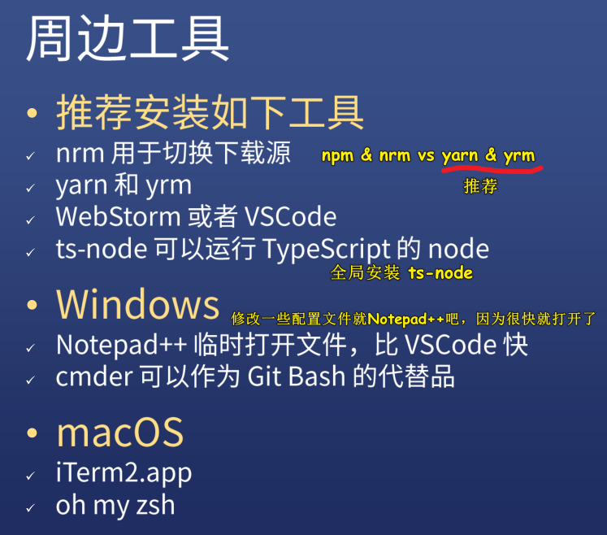
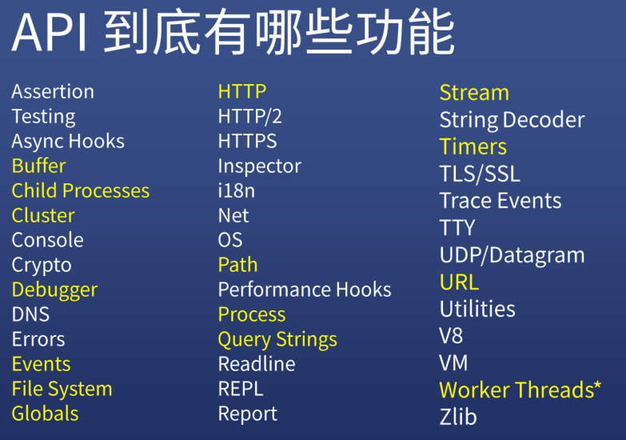

| ✍️ Tangxt | ⏳ 2020-08-11 | 🏷️ 总纲 |

# 01-Node.js 技术架构

> Node.js 是什么，以及它是由什么组成的！ -> 对于前端而言，关于底层 C++代码，只需要知道是做什么的，以及用到了哪些技术就行了！不需要去想这代码的逻辑是怎样的……

## ★引子

我先看了这个 [Node.js 基础篇](https://ppambler.github.io/nodejs/02/) （就看了视频的第一讲），但看完之后，我觉得这些知识点都是很零碎的，虽然内容都讲清楚了，但总觉得自己的脑海里并咩有对 Node.js 建立起一个总体性的认知，于是我就看了方方这节的免费课：[Node.js 全解及 Next.js 框架实践 - 写代码啦！](https://xiedaimala.com/courses/f0e0726e-6073-4b23-b590-387ff879f64a/random/1a2196ecc6#/common)

## ★JS 如何调用 C++

### <mark>1）Node.js 版本</mark>

双数是稳定版，单数是非稳定版，我们使用 8 以上版本

> Vue 3.0 在 8 里用会有些小问题，而 10 就没问题了！

### <mark>2）Node.js 安装</mark>


### <mark>3）周边工具</mark>



### <mark>4）Node.js 是什么？</mark>

> 讲 Node.js 是什么之前，先来讲讲 Node.js 不是什么……

#### <mark>1、Node.js 不是什么？</mark>

- **不是 Web 框架**
  - Node.js 并不是 web 后端框架
  - 所以你不能把 Node.js 与 Flask 或 Spring 对比
- **不是编程语言**
  - Node.js 并不是后端的 JS
  - 所以你不能把 Node.js 与 Python 或 PHP 对比

> 不要有这样的说辞「我该学 Node.js 好呢？还是 Python 好呢？」

#### <mark>2、Node.js 是什么？</mark>

- **是一个平台**
  - 它将多种技术组合起来了
  - 让 JavaScript 也能调用系统接口、开发后端应用
- Node.js 用到了哪些技术？
  - V8 引擎 -> 作者很牛逼，V1~V8 这 8 个虚拟机，而且这是不同语言的
  - libuv -> 非常有用的库，本来是 Node.js 作者写给自己用的，后来因为此库太有用了，所以导致了其它语言社区也在用这个库
  - C/C++ 实现的各种高性能的库： [c-ares](https://c-ares.haxx.se/)「实现 DNS 解析，域名的解析」、[http-parser](https://github.com/nodejs/http-parser)「解析 http」、[OpenSSL](https://www.openssl.org/)「搞 https」、[zlib](http://zlib.net/)「搞加密」等库

> 我们一般不区分 C 和 C++，因为它们俩都是可以通用的，说用 C 实现的高性能库也好，还是用 C++实现的高性能库也罢！

### <mark>5）Node.js 技术架构</mark>


- [0.10 版本](https://github.com/nodejs/node/tree/v0.10.0-release)
- [node 代码分析](https://github.com/yjhjstz/deep-into-node)：作者用了多篇文章分析了 Node.js 的核心架构 -> 讲得非常详细

接下来，就介绍一下该架构图里边提到的一个个东西！

### <mark>6）什么是 bindings？</mark>


Node.js 它调用了很多 C/C++的库，比如说 C++ 有一个库，叫 http_parser，它可以非常高效地处理 http 的一些内容，如它告诉你这部分是啥，下一部分是啥，每部分都有啥含义等等……

而我们在 Node.js 里，只能写 JS 呀！所以我们该如何调用 C/C++的库呢？

直接调？ -> 显然不行呀！JS 的数据类型与 C++的数据类型根本就不一样 -> 所以这根本就不存在一种直接调用的途径

那咋办呢？

Node.js 作者做了一些中间层的处理，封装了一些东西，如用 C++（必须用这门语言）对 http_parser 进行封装，使其能让 JS 的数据类型与 C++的数据类型统一化，如不管是`int/short/float……`还是啥的，都是`number`类型，都是一一对应的。

封装的结果就是「`http_parser_bindings.cpp`」（还有其它头文件）

总之，Node.js 作者为了让我们能够使用 `http_parser`，所以就写了一个 `http_parser_bindings.cpp`

除此之外，Node.js 还提供了一个编译工具，可以把 `http_parser_bindings.cpp` 编译成 `.node`这样的二进制文件或者可执行文件

我们的 JS 不能直接 require `.cpp`文件，但可以 require `.node`文件，这样一来，JS 就能调用 C++库了，而 Node.js 作者写的这个`http_parser_bindings.cpp`就叫做「binding」啦！

Node.js 作者除了封装 `http_parser` 这个库以外，还封装了其它库，也就是 Node.js 还提供了很多个`binding`，所以这就是「`bindings`」了！

由于是 Node.js 提供的 binding，所以全名就是「**Node.js bindings**」

回过头来看，Node.js 是如何使 JS 和 C/C++ 通信的呢？

> Node.js 在这中间加了一个个 C++ 模块，它可以使得这两者之间在数据类型上统一，以及其它方面的一些协调！

### <mark>7）JS 与 C++交互</mark>

> Node.js 还提供了其它交互方式，我这里只举其中的一个例子

- JS 调用 C++代码： [官方示例 1](http://nodejs.cn/api/addons.html#addons_function_arguments)
- C++调用 JS 回调：[官方示例 2](http://nodejs.cn/api/addons.html#addons_callbacks)

如何用 JS 调用 C++（自顶向下）？如何用 C++调用 JS 的函数（自底向上）？

#### <mark>1、示例 1</mark>

上述示例 1 里边的内容是 Node.js 的插件内容——**告诉我们如何写一个 C++的库，以及如何用 JS 调用这个库！**

如你写了一个 `addon.cc`（不完全是 C 代码，夹杂着 C++代码，所以就说成是`C/C++`了） -> 编译它 -> 得到`.node`文件 -> 在 JS 里使用它`const addon = require('./build/Release/addon')`（可以省略`.node`后缀）

我们

``` js
addon.add(3, 5)
```

，其实就是做：

``` c++
// add 方法的实现
// args 是你传给 C++的参数数组，也就是类似 [3,5] 这种形式
void Add(const FunctionCallbackInfo<Value>& args) {
  // 如果你只传一个参数就报「参数的数量错误」返回给你 JS
  // 如果你传的不是 Number 类型的，那就报「参数错误」返回给你 JS
  // 两个检查都通过了，那就把俩参数加起来，得到了一个新的 Number 类型的值，然后返回给你 JS，这样 addon.add(3, 5) 就是一个 「8」的返回值
}
```

> 突然感觉，把 JS 数值类型的 `3` 和 `5` ，经过 `binding` **加工**后，变成了 C/C++ 可处理的类型，C/C++ 处理之后，返回了一个  `double` 类型的 `8`，然后再把 `8` 这个值通过 `binding` **过滤**成 JS 可以处理的 `Number`类型 `8`

我看了一下这个：

```c++
void Add(const FunctionCallbackInfo<Value>& args) {
   // 执行操作
  double value =
      args[0].As<Number>()->Value() + args[1].As<Number>()->Value();
  Local<Number> num = Number::New(isolate, value);

  // 设置返回值 （使用传入的 FunctionCallbackInfo<Value>&)。
  args.GetReturnValue().Set(num);
}
```

似乎 `Local<Number> num = Number::New(isolate, value);` 这一步就完成了`double` `8` 的数据类型转换……（`isolate`很复杂）

不管怎样，总体上看，`addon.add(3, 5)`就是在调用`addon.cc`里的`Add`函数（以后如果你想了解`add`这个函数是怎么写的，那么你就得看底层的`.cc`文件了！ -> 关于对象之间的通信：`addon`要做加法行为，被操作的对象是`3`和`5` -> `you.cut('hand')`双十一你要剁手，行为是「剁」，要「剁」的对象是「手」，而不是「脚」）

---

可以看到这个例子是可以证明 JS 是可以直接调用 C++的代码的！（不止是这一种方法可以做到！方方演示的是文档里写的方法）

---

#### <mark>2、示例 2</mark>

C++ 如何调用 JS 里的函数？

> 把 JavaScript 函数传入到一个 C++ 函数并在那里执行它们，这在插件里是常见的做法。

``` js
// test.js
const addon = require('./build/Release/addon');

addon((msg) => {
  console.log(msg);
// 打印：'hello world'
});
```

我们把一个 callback 作为一个参数传给了`addon`，我们 JS 并咩有调用`callback`！

 

C++内存里的`String`与 JS 的是不一样的，所以需要构造转化一下……搞成是 JS 能看懂的`String`

C++底层的`addon`执行，其函数体内`cb -> Call("hello world")` -> 也就是把`"hello world"`传给了上层的`(msg) => {console.log(msg)}`去调用 -> 说白了，就是底层抛一个数据给上层的`msg`

> 一个疑问：是底层就执行了`callback`，`log`一个`"hello world"`，还是 把数据抛给上层的 JS，然后交给 `v8` 引擎自己去执行 `callback`？

我觉得是在底层调的`callback`！毕竟`addon`这个函数是 C/C++ 写的！ -> 似乎 V8 引擎就是 C/C++ 写的，所以执行 C/C++ 代码时，应该也是由 V8 引擎做的吧……

> 额，我似乎遗忘了 Node.js 提供的**编译工具**，我们为 Node.js 写 C/C++ 插件，其实得要按照某种要求来写，编译工具把写好的`xxx_binding.cpp`文件编译成可供 V8 引擎执行的 `.node` 文件……也就是说，我们看 `.cpp` 代码 就是在看某个函数是怎么写的……真正的代码执行还是交给了 V8 引擎！我们之所以能让 Node.js 使用其它 C/C++ 写的高性能的库，那是因为我们「封装了一个个`xxx_binding.cpp`（得符合某种要求去写，如需要处理一下类型配对的问题）+编译工具（把`xxx_binding.cpp`编译成 V8 引擎可执行的文件，而不是传统的把`.cpp`交给`C++`编译器去搞）」 -> 我们说的 「C/C++ 扩展」就是 `xxx_binding.cpp`，而「编译过的 C/C++ 扩展」，也就是 V8 引擎能执行的 `xxx.node` -> 文件名：`addon.cc -> addon.node` -> **所谓的高性能的库，我想应该是这个库的代码写得非常好吧！而不是因为用了 C/C++** -> 疑问：Node.js 提供的编译工具真得把所有的 C/C++ 代码都给编译成 `xxx.node`，然后交给 V8 引擎去执行？难道就没有其它线程去编译执行 C/C++ 写的代码？

---

话说，我写 Node.js ，还要会 C++ 吗？

不用会，你**只要知道 JS 和 C/C++ 是如何交互的就行了** -> 大部分人写 Node.js 是不需要会 C++的，而且对于方方来说，方方也不会写 C++代码，只是能看懂，能看懂 C++ 代码在做什么……

---

Node.js 还提供了其它交互方式 -> **只要你能让 JS 去调用 C++ 这件事做好了，那么 JS 的能力就会被无限扩大**

---

### <mark>8）C/C++ 插件（自定义其它能力）</mark>

我们知道 Node.js bindings 的存在 就是为了让 JS 和 C/C++通信 -> Node.js bindings 这个能力使得 Node.js 的能力大大的被扩展了……

那么问题来了

Node.js 提供的这些 bindings 我们可以用的，但是如果有一个新的 C++库，如 xxx 写的关于区块链的库，而 Node.js 并咩有把这个库 binding 进来，你说我们该怎么办呢？

所以 Node.js 就提供了这么一个能力——你可以自己写 C++，然后把这些 C++绑定到 JS 上，然后 JS 就可以调用这些 C++库了

当然，大部分 Node.js 程序员是不会这一块的，即不会为 Node.js 自定义其它的能力！

> 了解一下即可，如果某一天你突然发现自己好像得要去学 C++，那么你就好好看一下这块内容呗！
> 
> 自己写的 C++ ，是不需要用 Node.js 提供的编译工具，编译一下，然后再使用？

接下来，看看 Node.js 的工作流程……

## ★Node.js `v0.10.0` 的 deps 目录


> deps 目录：在程序里，一般指的是所有依赖……

Node.js 依赖了 7 个 C/C++库 -> **只需要知道 「v8」和「uv」(libuv) 这两个库就行了**！其它的库，只需要了解是干嘛的就行了，如「zlib」是专门用来做压缩用的……

现在最新版的（`v14.8.0`）：


## ★libuv & v8 的功能

### <mark>1）libuv 是什么？</mark>


libuv -> lib 是前缀，库名叫「uv」(Unicorn Velociraptor—独角伶盗龙）


libuv 是怎样诞生的？

诞生的背景：

Ryan 起初想搞一个基于事件驱动、非阻塞 I/O 的 Web 服务器（也叫 Web 处理程序），以达到更高的性能，提供 Apache 等服务器之外的选择。

Ryan 发现每个平台旗下都有各自的 异步 I/O 库，所以 Ryan 觉得自己咩有必要为每个平台都写一个 Node.js 

于是，Ryan 特别机智的就把这些异步 I/O 库整合到一起，然后写了一个库，而这个库就是「libuv」 -> 目的是「写一个**跨平台**的异步 I/O 库」

---

话说，「I/O」是什么？

所有的输入、输出都属于 I/O，如：

- 写文件 -> 你从你的操作系统上写文件写到硬盘上
- 访问网络 -> 你从你的操作系统发出数据到别人的服务器上
- 打印文档 -> 连接打印机，发份文档给打印机打印
- ……

只要是输入或者输出都属于 I/O 操作！也就是说**系统跟其它的外界进行交互的所有功能都是 I/O** -> 如`readFile()`这个功能与文件系统打交道，所以这是 I/O 操作！

---

libuv 会根据当前系统自动选择已经实现好的 异步 I/O 库！

libuv 的主要功能（所以的功能都是异步的）：

- 可以操作 TCP -> 有啥用？ -> 我们知道 HTTP 是基于 TCP/IP 的，所以只要能操作 TCP，我们就可以做 HTTP 的服务器
- 操作 UDP -> 一般聊天，如 QQ 聊天都是基于 UDP 的，虽然可能会丢包，但不需要三次握手什么的，所以即便不那么稳，但效率还是比较高的！
- 解析 DNS -> 解析 baidu.com 对应哪个 ip，不然怎么知道该向哪个服务器发起请求呢？
- 操作文件 -> 读文件、写文件等这些操作，libuv 都可以帮我们管理！
- ……

有了这些功能，Node.js 就可以摆脱 I/O 瓶颈，即 **I/O 全都交给 C/C++来做**，我 JS 一概不管这些功能……我 JS 只负责做一些简单的如调用之类的东西

> 不需要去看 libuv 的源代码……

### <mark>2）V8 是什么？</mark>


V8 是作者写的第 8 个虚拟机？

> V8 是一个由 Google 开发的开源 JavaScript 引擎，用于 Google Chrome 及 Chromium 中。Lars Bak 是这个项目的组长，以 V8 发动机为其命名 -> 它也被用于服务器端，例如 Couchbase、MongoDB、Node.js……
> 
> V8 引擎是一个 JavaScript 引擎实现，最初由一些语言方面专家设计，后被谷歌收购，随后谷歌对其进行了开源？
> 
> V8 将 JS 代码编译成**原生机器码**（IA-32, x86-64, ARM, or MIPS CPUs），并且使用了如内联缓存（inline caching）等方法来提高性能。有了这些功能，JavaScript 程序在 V8 引擎下的运行速度媲美二进制程序。

它有哪些功能？

- JS 源代码 -> V8 引擎 -> 机器代码（`0101101……`）「计算机看到这些代码就可以直接执行，不需要再借助任何的其它工具了，就好像我们在 windows 里边双击一个 `xx.exe`文件，然后弹出一个框一样，所以它是非常高效的，目前 V8 是商用里边执行最快的这么一个 JS 引擎」
- 维护 Call Stack -> 这不是 JS 自己维护的，而是所运行的这个 V8 引擎维护的
- 负责内存管理 -> 你 `new Xxx()`，这个对象被存在哪个旮旯是 V8 引擎决定的……
- 辣鸡回收 -> 是为了「重复利用」，而不是「把无用的给清了」…… -> 内存是有限的，必须做辣鸡回收，如你用了 2K 内存，那么你用完了就得还给我，因为我还得给下一个程序用呢！ -> 总之辣鸡回收的目的是为了**重复利用内存**，而不是用了一次，就死在那儿了……就像是上厕所那样，你总不能把这个坑一直蹲到世界末日吧……
- V8 还要实现 JS 的各种标准库，如数组里的`sort/map/filter/reduce`等函数，这些函数都要 V8 自己实现好，不然，JS 就调用不了了，所以 V8 的功能是非常多的……

话说，V8 有这么多功能，那么它是多线程的吗？

是的，它是多线程的，如：

- 它开一个线程执行 JS
- 开一个线程清理内存
- 开一个线程管理其它的东西
- ……

总之，V8 本身是多线程的

注意：

- V8 不提供 DOM API -> 这 DOM API 是浏览器提供的
- V8 执行 JS 的过程是单线程的，注意，**只是执行 JS 是单线程的**！它的内存管理是一个线程，辣鸡回收可能是另一个线程 -> V8 本身是多线程的，可不是单线程的！
- 理论上，可以开两个线程分别执行 JS，这样一来就是多线程执行 JS 了呀！但这并不是真正意义上的多线程，只是开了两个东西去跑 JS 而已，而这两个 JS 毫无瓜葛……
- 辣鸡回收非常复杂，可能不止一个单独线程……
- V8 天生自带 event loop，我们要用它的 event loop 是咩有问题的，但是 Node.js 并咩有用它的，而是自己基于 libuv 自己做了一个 event loop -> 总之，V8 有 event loop，但 Node.js 并没有用，而是自己造了一个

> 知识点：知道 v8 的功能以及 V8 是不是单线程的？

> 浏览器的事件循环是 V8 提供的？ -> 浏览器的事件循环标准是由 HTML 标准规定的，具体来说就是由 whatwg 规定的

---

接下来看看「什么是 event loop？」

## ★EventLoop 简单介绍


Event Loop 是两个单词，可不是一个完整的单词

### <mark>1）什么是 Event？</mark>

就是信号

JS 不知道什么时候文件是可以读的，什么时候文件是可以写的，毕竟当你在拷贝一个东西 A 的时候，你再拷贝一个东西 B 时，这个 B 拷贝得比正常拷贝时要慢很多，而这是因为读取硬盘的速度是极限的……如一般的机械硬盘，大概是 20M~50M/s 这样，而固态硬盘则有 100 多 M/s 这样……

当文件系统告知可以读的时候，就会单独发个信号给 JS……读取出错了，也发单独发个信号给 JS

socket 一般在 TCP、UDP 编程时会用到！可简单理解为 HTTP 里边的一个消息，如用户请求服务器，而服务器要读用户的内容，于是这操作系统得告诉我才行……socket 有内容了，得告诉 JS，socket 关闭了也得告诉 JS

事件一般分两种：

- 内部的：计时器到点了就发信号告诉 JS
- 外部的：读取文件操作，文件在硬盘上，而操作系统与硬盘是分开的！socket 也是外部的，因为这是从另一台机器传过来的……

总之，事件分为内部的计时器，以及外部的文件读取、网络请求等

### <mark>2）什么是 Loop?</mark>

for 循环的英文是 for loop

我们要循环是什么？可事件有啥好循环的？

不同的事件是有优先级的，也就说 Node.js 处理哪个信号是有优先级的……

举例来说：


图中有三种不同的事件，其中关于文件读写操作，你要记住，不是你写了 `fs.readFile('./1.txt',f2)`，Node.js 就会立刻开一个线程去读这个`1.txt`文件的，它需要等，等到系统说可以读了，你这线程才可以去读，而什么时候可以读，是不确定的……

> 一个疑问：`readFile`这个 API 是可以读文件了，才会去执行它的`callback`吗？还是读完了再去执行它的`callback`？ -> 读取完成后会发信号通知给 JS 执行`callback`

那么问题来了，如果这三种不同的事件，**几乎同时**发信号过来，那么会先执行谁的 callback？

所以我们得制定一个规则，不然这就像去食堂打饭一样，不排队，一窝蜂似地聚集在打饭窗口，而此时食堂大妈都不知道先打哪个人的饭菜了，你说先帮 A 打吧？但 B 说「凭啥先打 A 的，明明我先来的……」

那么该如何制定规则呢？

这些规则都是**人为规定的**，没有什么规范说，必须先这样，然后那样……比如读文件是很重要的，那就先处理 `f2`，而服务器 `close`，可以排第二处理，而计时器没啥重要的，那就最后一个处理呗！

由于信号可以是源源不断地产生的，如你在一个定时器的 callback 里，也搞了一个`readFile`，那么信号在某个时刻，又会抛给 JS，所以这就需要不停地读「xxx 信号有吗？yyy 信号有吗？zzz 信号有吗？」 -> 这一点像是「轮询」，如每天早上都会有人开着个大三轮车，拿着给喇叭在喊「收废品咯！张三你家有废品吗？李四你家有废品吗？……」当然，每天这样问，肯定会让人感到厌烦的，所以，有时候，就不喊谁家有废品了，而是直接喊一句「收废品」然后开过一条街就算了……

### <mark>3）Event Loop</mark>

操作系统往上层抛信号给 JS -> JS 处理事件

而 **Event Loop 就是对事件处理顺序的精确管理**

### <mark>4）Event Loop 是怎样处理顺序的？</mark>


> [官方文档翻译](https://juejin.im/post/5ab7677f6fb9a028d56711d0) -> 方方花了 5 个小时翻译，虽然内容很长，但非常值得！

I/O callbacks 指的是其它的回调（如清理战场之类），不归类，一般我们不管，可忽略不计……

poll 阶段处理大部分的请求，如文件可以读了，http 请求来了……

check 阶段主要处理 `setImmediate` 回调……

close callbacks -> 看看有咩有 sockets 关闭了之类的回调……

Event Loop 不会一直循环过每个阶段，它会在某个时刻里停留在 poll 阶段一段时间，如停个 100m 之后，就走一个阶段……


注意：

读文件不是由 Node.js 做的，而是由 Node.js 依赖的 libuv 做的，所以在 C++ 读文件的时候，Node.js 就在一旁看着……读完之后，再传给 Node.js ，然后 JS 再去执行`callback`

如果你这样写：`setTimeout(callback,100)`，那么`callback`的最终执行时刻是 `>= 100 ms`

如果此时轮询到 `poll` 阶段，也就说是你在 「酒店」 收着废品，突然 张三告诉你，我家有废品，你过来收一下，那么此时不会直接跳到张三家里去，而是先去问问「赵六、孙七」家有没废品……这俩阶段走完了，再去「张三家」……

每个阶段都有 `callback` 队列，这些一个 callback 都在排队着，等待着被选中 -> 这就像是 NBA 选秀一样，`poll`阶段的`callback`（球员）就是首轮秀……而其它阶段的就是二轮秀这样

> 每个阶段都是平等的……只是 `poll` 阶段停留时间最长……这各个阶段咩有优先级之分，而所谓的优先级只是因为「`poll`阶段停留时间最长」才赋予其中的`callback`有优先级最高的味道…… -> 为啥在`poll`阶段里停留时间最长？——因为这里的信号都是有利于提高性能的、很重要的……

网上经常有人问到「`setTimeout(f1,0)` 和 `setImmediate(f2)` ，其中哪个`callback`先执行？」

答案是不确定的，大部分都是先执行`f2`，因为`poll`阶段停留时间最长……当然，有一个情况例外，那就是 Node.js 第一次刚进来的时候，也就是把 JS 代码执行完后，第一次进入 Event Loop 的时候，看看 `timers` 有无`callback`

> 浏览器就只有两个队列：宏队列和微队列 -> 左右左右左右……这样两个阶段的循环，而 Node.js 则分为几个呢！
> 
> poll 阶段才是一个轮询实现，而不是整个 Event Loop，poll 阶段会轮询操作系统，所以这一阶段停留时间比较长……
> 
> Node.js 第一次进入 Event Loop 会先走 `timers` ，如果发现`times`里边闹钟还要等 50ms 才响，那么就直接走到下一个阶段去了，而`poll`阶段是停留时间最长的，因为这个阶段里的食物很好吃（这个阶段的事情最重要，因为这是操作系统给来的东西）……

### <mark>5）总结</mark>


Node.js 去读文件本来是同步操作，但有了 libuv 之后，就交给 libuv 去做了，而 Node.js 就去干其它事儿了，libuv 读完之后，就交给 Node.js 去做剩下的事儿了……

Node.js 提供了一些官方库，如`http/fs`……来简化我们的 JS 代码复杂度 -> 不需要我们自己写，Node.js 提供的这些库都已经帮我们写好了！

为什么 Node.js 可以高效的处理请求呢？ -> 因为它直接用 C/C++的代码……而这肯定要比 JS 快！

Node.js 背后涉及到的技术非常多！

### <mark>6）Node.js 工作流程</mark>


把 JS 代码、JS 引擎（V8）、Node.js Bindings、libuv 组合到一起！

Application（你写的 JS 代码） -> V8（把你的 JS 代码放在这儿执行，发现有异步代码，如`setTimeout`） -> 调用 Node API 或 Binding 把`setTimeout`放到「Event Loop」里边，告诉「Event Loop」100ms 后处理它的`callback`

不同的系统有不同的队列，图中 6 个，其它系统可能有 5 个！ -> 浏览器 2 个（宏队列、微队列）

Event Loop 在恰当的时机就会把每个阶段里的 callback 按顺序 push 到 V8 里的 Stack 中执行……

在 poll 阶段，读文件，libuv 会开一个线程去读这个文件，Node.js 不参与整个读文件的过程，文件读完后，操作系统就会抛一个信号回来，Event Loop 看到在恰当的时机看到信号来了，就把信号对应的 callback push 给 V8 去处理执行……

同理，网络请求也是如此，libuv 得到用户传来的网络请求，就会把其塞到 poll 阶段

v8 和 libuv 是最重要的，而 Node.js Bindins 和 Node API 就是中间的桥梁

而我们的 JS 代码，是整个 Node.js 平台很小的一部分！

Node.js 的工作流程，简单来说：

代码 -> V8 -> Node API -> 透过「libuv 提供的功能」+「C/C++提供的功能」来完成用户所需要的功能！

我们不需要深入了解 libuv，对图中的信息有个大概了解就好了！

### <mark>7）回顾 Node.js 技术架构</mark>


最上边这个就是 Node.js 提供给我们开发者使用的 API，也就是一个个内置模块，我们一般并不知道这些模块是怎么实现的，但是如果，我们深入底层了解一下，你就会知道，这些都是 Node.js 提供的 bindings，这 bindings 会调用 V8、libuv、C/C++库等各种功能

如果你使用 Node.js 一年，发现自己不满足现在已有的 Node.js 知识，那么你可以去了解一下各种 API 底层实现的运行原理，不过，你可能要学好 C/C++ 了！不然，你连 C/C++ 的类型都看不懂……

## ★Node.js 技术架构总结

- bindings：把 C/C++ 库封装一下给 JS 用，而且 JS 还可以把数据传给这些底层库！
- Node.js 的工作流程，就是把模块整合起来，各司其职，协同合作……
- Node.js 不是一门语言，也不是一个 web 框架，就是一个 平台 -> 这个品台上放了 V8、libuv 等
- 你想到的操作基本上都是 I/O 操作！除了加减乘除、内存一些对象什么的……
- libuv 是异步的库，重点是「异步」，整合了各个平台的库
- V8 执行 JS 是单线程，执行 JS 只是它的能力之一……
- Event Loop 知道每个阶段此时都有哪些任务正在处理中……如知道 timers 阶段有个 50ms 计时器、知道 poll 阶段有个文件操作还在被操作系统处理着……如果都没有啥异步任务，Event Loop 大部分时间停留在 poll 阶段！
- 我们学习 Node.js ，主要学习的是 Node.js API！

## ★Node.js API 与学习方案

### <mark>1）Node.js API</mark>

> 所谓 API 就是官方提供给我们用的函数

#### <mark>1、API 文档</mark>

- 官方地址 -> 字典，内容很多，看这个 API 文档是没办法学习的
  - 英文文档：[nodejs.org/api/](https://nodejs.org/api/)
  - 中文文档：[nodejs.cn/api/](http://nodejs.cn/api/)
- 民间版本
  - devdocs.io -> dev（开发者） + docs（文档）
  - 进入之后开启 Node.js 10 LTS（双击`enable`） -> 开启可以搜索 API
  - 搜索功能非常方便 -> 相较于官方文档
  - 可开启暗黑主题
  - 可离线观看

注：


#### <mark>2、Node.js 到底提供了多少 API？</mark>



透过上边这张图，你可以大概知道 Node.js 能做什么……

> 白色的基本用不上……只需要知道有这么一个东西就好了！

1. Assertion -> 断言，测试代码的工具（非常好用）
2. Buffer -> 一小段缓存 -> HTTP 请求，用户一点一点上传内容，不可能一个文件一下子就上传上来了，如文件 100M，每次上传一点就是一个 buffer 或多个 buffer，内存处理的数据是有限的，每次只能处理一点一点的数据…… -> 着重学习的模块
3. Child Processes -> 子进程（紫荆城），简单理解成两个 Node.js ，两个 V8，分别去处理不同的事情，而这就是进程
4. Cluster -> 集群，把多个 Node.js 综合到一起，每个 Node.js 所做的事情是不同的，它们之间的关系是「你是主要的，我是次要的」 -> 与「Child Processes」很像，但实际上写法很不一样
5. Crypto -> 加密
6. Debugger -> 调试
7. DNS  -> 透过 Node.js 访问 DNS -> 我们终端输入「`nslookup baidu.com`」，得到一些 ip 地址之类的数据（操作系统可以知道一个域名所对应的 ip 的），那么 Node.js 怎么知道呢？透过 DNS 这个模块就知道了呀！ -> `dns.lookup('baidu.com',options,callback)`
8. Errors -> Node.js 里所有的错误 -> 默认错误很多，看文档看到崩溃，所以你最好是用到了再去看！
9. Events -> 发布订阅设计模式 -> Node.js 自带了（内置了）这个模式 -> `emmitter.on/off/emit`，如果一个对象给提供了 `on/off/emit` 这 3 个 API，基本上你可以认为它是一个发布订阅模式
10. File System -> 对文件的 CRUD，对目录的 CRUD -> 涉及文件的操作就看它
11. Globals -> Node.js 所有的全局变量，如`__dirname`（当前文件所在的目录） -> 任何时候都可以用的东西
12. Path -> 操作路径，如获取当前操作系统的根路径，而不是自己去读硬盘上的字节
13. Process -> 当前进程的相关信息，如当前进程运行多久了？
14. Query Strings -> HTTP 请求时的 URL 处理
15. Stream -> 处理流格式的数据 -> 注重讲
16. Timers -> `setTimeout、setInterval、setImmediate` -> 注重讲
17. URL -> 处理 URL
18. Worker Threads -> Node.js 10 之后才有的功能，Node.js 8 用不了！

黄色标注的都是重点 API，项目里常用！

### <mark>2）学习路线</mark>


#### <mark>1、基础-Web-框架</mark>

基础是什么？ -> 知道 Node.js 提供的这些 API 都有什么功能，以及怎么用

什么叫以任务为导向？ -> 学了一个文件模块，那就做一个基于「文件」的小应用；学了一个 HTTP 模块，就基于「HTTP」做一个静态网站（比较简单）或动态网站；学了一个 Stream，那就基于「Stream」来处理一个很大的文件，一次性读到内存里很麻烦，那么就可以用「Stream」来读！

基础知识学会了，学啥？ -> 你要知道**我们学 Node，实际上是为了学习后端**呀！所以我们需要学习一些后端知识（Web）

如数据库怎么连接？AJAX 怎么处理？cookie 怎么做？session 怎么做？登录怎么做？

以上知识学完之后，我们基本上就知道了 Node.js 是如何做后端开发的！

但是有个问题就是，我们做的东西太简陋了，我们需要一个强大的工具把我们做的东西做得更强壮！ -> 那就是我们要用「框架」了！

不止学一个框架，其中 Express 这个框架是必学的！

框架都是对前边所学知识（API+Web）的应用！

学习 Express 不是看一遍文档就完事儿了，你要透过它做一个完整的网站！

在做完整的过程中，你就会知道这各种功能到底是怎么实现的？

#### <mark>2、三个约定</mark>

学习 Node.js 一定要遵守这 3 个约定！

1. 记笔记、写博客 -> 这节课「告诉你 Node.js 是什么」
2. CRM -> 拷文档代码，在本地机器运行代码，改代码，再运行 -> 如此反复…… -> 学习各种技术最快的方式
3. 看方方写代码时 -> 学习如何命名，如何设计文件的分布，如何设计函数的分布 -> 重点学习方法的调试过程……

## ★参考文档

- [C++ binding with Node.js ](https://pravinchavan.wordpress.com/2013/11/08/c-binding-with-node-js/)
- [Understanding Worker Threads in Node.js ](https://nodesource.com/blog/worker-threads-nodejs/)

## ★直播问答

### <mark>1）如何记笔记？</mark>

东京大学笔记法

不要问 x-y 问题 -> 你遇到一个问题 x，但是你问了一个 y 的解决方案，然后别人就跟你争论 y 这个解决方案是对还是错，实际上你应该直接问 x 该怎么做…… -> 简单来说，你问的东西，跟你想要的东西是两个东西，导致浪费时间！

截图全屏

对抗遗忘 -> 1、7、14、21……回顾笔记，回顾是提升记忆的一个方法……

这节课的笔记：Node.js 技术架构有什么，以及它们各自都有啥用？+Node.js API

### <mark>2）做项目用 MySQL 数据库吗？</mark>

理论上用啥数据库都行……默认用最广泛的……如 MySQL、MongoDB、graphQL……

重点模块 -> 文件模块、网络模块、stream、child_process……

### <mark>3）中间件是什么？</mark>

用到了就知道了 -> 简单到一个函数是一个中间件，甚至一个很大的库都是中间件 -> 中间件简单来说就是处于中间的东西

## ★了解更多

➹：[使用 http_parser 解析 URL - SumyBlog](https://sumygg.com/2015/11/24/use-http-parser-to-parse-url/)

➹：[nodejs/http-parser: http request/response parser for c](https://github.com/nodejs/http-parser)

➹：[libuv - 维基百科，自由的百科全书](https://zh.wikipedia.org/wiki/Libuv)

➹：[Libuv 初理解 - 掘金](https://juejin.im/post/6844903575441637383)

➹：[V8 (JavaScript engine) - Wikipedia](https://en.wikipedia.org/wiki/V8_(JavaScript_engine))

➹：[认识 V8 引擎 - 知乎](https://zhuanlan.zhihu.com/p/27628685)

➹：[JavaScript 深入浅出第 4 课：V8 引擎是如何工作的？](https://blog.fundebug.com/2019/07/16/how-does-v8-work/)

➹：➹：[一文看懂浏览器事件循环 - 掘金](https://juejin.im/post/6844903971228745735)

## ★总结

- Node.js 的技术架构 -> 你学其它东西的时候，先看它的整体架构
- 我们要学的：Node.js API -> Web 后端知识 -> 框架知识（代码更健壮）
- 做小任务理解知识点，做项目整合所学的知识，用于生产环境中，以便面试找工作！

## ★Q&A

### <mark>1）什么是背景？</mark>

➹：➹：[时代背景，历史背景，文化背景是什么意思？_百度知道](https://zhidao.baidu.com/question/2203257785868852828.html)

### <mark>2）张三、李四、王五后面还有哪些？</mark>

➹：[张三李四王五赵六后面还有哪些？_百度知道](https://zhidao.baidu.com/question/937987617066811052.html)

➹：[有张三李四王五赵六，那前面是啥一啥二啊？ - 知乎](https://www.zhihu.com/question/306842134)
