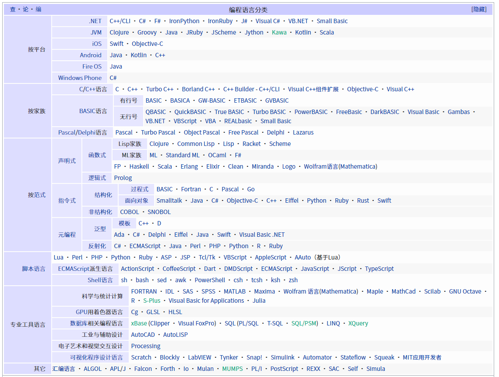

| ✍️ Tangxt | ⏳ 2020-08-09 | 🏷️ 基础 |

# 01-编译过程、I_O 操作、node 应用场景

## ★概述

1）Node.js 是什么？

JavaScript 的运行时 -> 简单来说，就是 JavaScript 的运行环境……就如同浏览器这样

2）前后端的区别？

网络前和网络后

3）前端界面基于啥开发？

- 浏览器：HTML、JS 、CSS
- 安卓：Java、Python、C++、C#
- IOS：C++、Objective-C、Swift

4）服务端

- 系统：Linux（一般用这个）
- 用到的开发语言：Java、C++、Ruby、Python、Go、C#、PHP、JavaScript（Node.js ）……

5）计算机语言 vs 编程语言

计算机语言分类：

- 架构描述语言
- 硬件描述语言
- 置标语言
- 建模语言
- 编程语言
- 查询语言
- 规约语言
- 样式表语言
- 模板语言
- 转换语言

> HTML 是计算机语言，也是标记语言，由于不具备逻辑，所以不是编程语言！
> 
> 编程语言是一颗树，计算机语言则是一片森林……

编程语言分类：

> 编程语言最基本的，得有「变量」「函数」「逻辑（计算机处理数据采取行动，顺序分支循环）」 -> CHO

一般来说，我们对编程语言的类型细分的话，就只有三种：

1. 机器语言：CPU 直接执行 -> 机器码、原生码、二进制码 -> 010101…… -> 计算机能直接识别！ -> 缺点，可能有逻辑，但是就是看不懂，对程序员来说难以维护，容易 bug，开发效率低到爆……当然，执行速度天下第一…… -> 基本咩有人用这语言开发了……
2. 汇编语言：二进制程序是不可读的，根本看不出来机器干了什么。为了解决可读性的问题，以及偶尔的编辑需求，就诞生了汇编语言 -> **汇编语言是二进制指令的文本形式** -> 梯形图、PLC（控制频率输出）、嵌入式…… -> 有 FOXRPO 系、xxx 系等的汇编语言 -> 黑盒测试偶尔会需要用到汇编来看栈数据
3. 高级语言：采用人类能认识的单词……富有语义性……更接近人类的自然语言 -> `if/else/var……` -> 让我们编程更容易，可读性更强 -> 更人性化

➹：[Programming language - Wikipedia](https://en.wikipedia.org/wiki/Programming_language)

➹：[汇编语言入门教程 - 阮一峰的网络日志](https://www.ruanyifeng.com/blog/2018/01/assembly-language-primer.html)

6）为啥说「Java 比 C 高级，Node.js 比 Java 高级」？这「高级」指是什么？

高级是上层逻辑，低级是底层逻辑！

「高级」主要体现在代码方面 -> Java不需要自己手动辣鸡回收，而C则需要手动辣鸡回收 -> 在搞多线程的时候，Node.js 不需要手动管理线程池，当然也可以手动管理，而Java必须手动管理线程池

> 越高级，我们开发者要干的活越少……同时，代码也会更抽象……

7）不管是高级语言，还是汇编语言，都会存在一个编译过程

